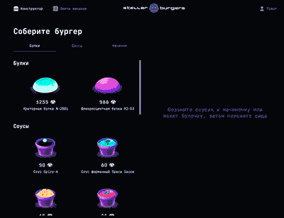

# Учебный проект в рамках курса React-Продвинутый: [Stellar-Burger](https://grafdev.github.io/Stellar-burger/)




Stella-Burger - это веб-приложение, которое позволяет заказывать бургеры по своему вкусу. Вы можете создавать свои уникальные рецепты с помощью удобного конструктора, перетаскивая ингредиенты мышкой. Ваш заказ будет отображаться в общей ленте заказов, которая обновляется в режиме реального времени с использованием технологии WebSocket. Вы также можете просматривать свои заказы в личном кабинете, где вы можете изменить свои данные или сбросить пароль. Приложение поддерживает динамические роуты, которые позволяют открывать детали заказа или ингредиента в модальном окне или на отдельной странице в зависимости от способа перехода.


## GitHub Pages:
[Stelalr-Burger](https://grafdev.github.io/Stellar-burger/)

## Stacks:
* TypeScript
* React
* Redux
* Web-Socket


## Быстрый старт

<br />

1. Склонировать проект на свой компьютер

```bash
git https://github.com/GrafDev/Stellar-burger.git

```

2. Перейти в папку с проектом и установить зависимости в проекте

```bash

npm install
```

3. Запустить проект

```bash
npm start
```

